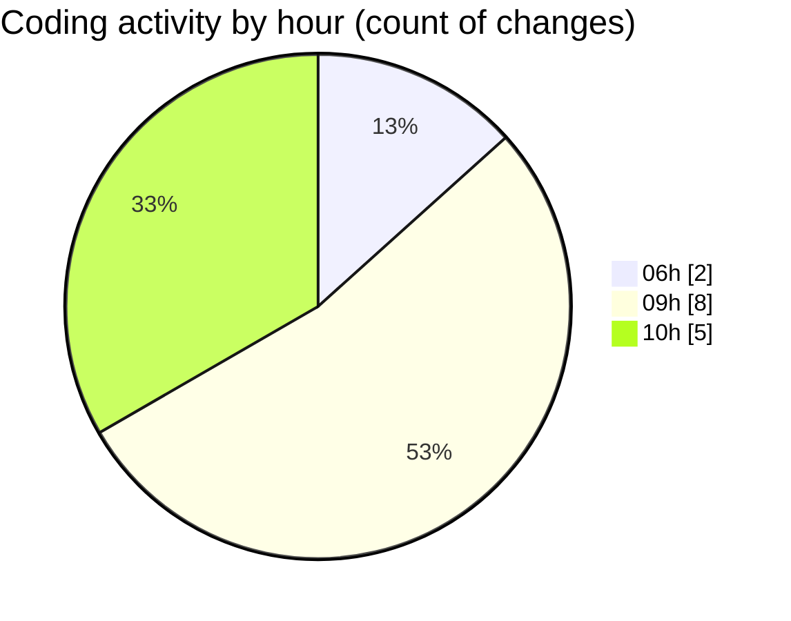

# workbench (Workspace) - Activity Summary 

## Overall Statistics

| Stat                   | Value                                                             |
| ---------------------- | ----------------------------------------------------------------- |
| **Lines Added** (➕)   | 177                                          |
| **Lines Removed** (➖) | 4                                        |
| **Net Change** (↕)    | 173                |
| **Active Time** (⌚)   | 18 minutes |

## Modified Files
- **settings.json** (+121, -4)
- **workbench.code-workspace** (+54, -0)
- **browserAllowlist.txt** (+2, -0)

## Visualizations

### By File Type (Lines Changed)

### By Hour (Estimated Activity Count)

> **Last Updated:** 2/24/2026, 10:46:30 AM