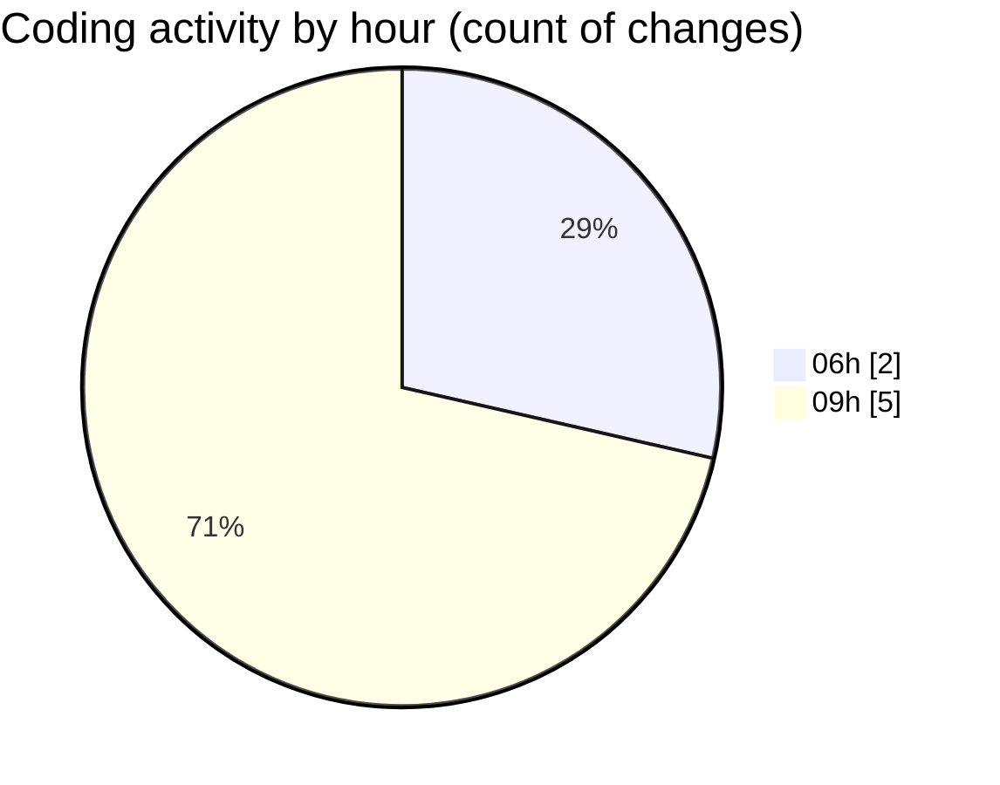

# workbench (Workspace) - Activity Summary 

## Overall Statistics

| Stat                   | Value                                                             |
| ---------------------- | ----------------------------------------------------------------- |
| **Lines Added** (➕)   | 132                                          |
| **Lines Removed** (➖) | 2                                        |
| **Net Change** (↕)    | 130                |
| **Active Time** (⌚)   | 4 minutes |

## Modified Files
- **settings.json** (+78, -2)
- **workbench.code-workspace** (+54, -0)

## Visualizations

### By File Type (Lines Changed)

### By Hour (Estimated Activity Count)

> **Last Updated:** 2/24/2026, 9:24:49 AM