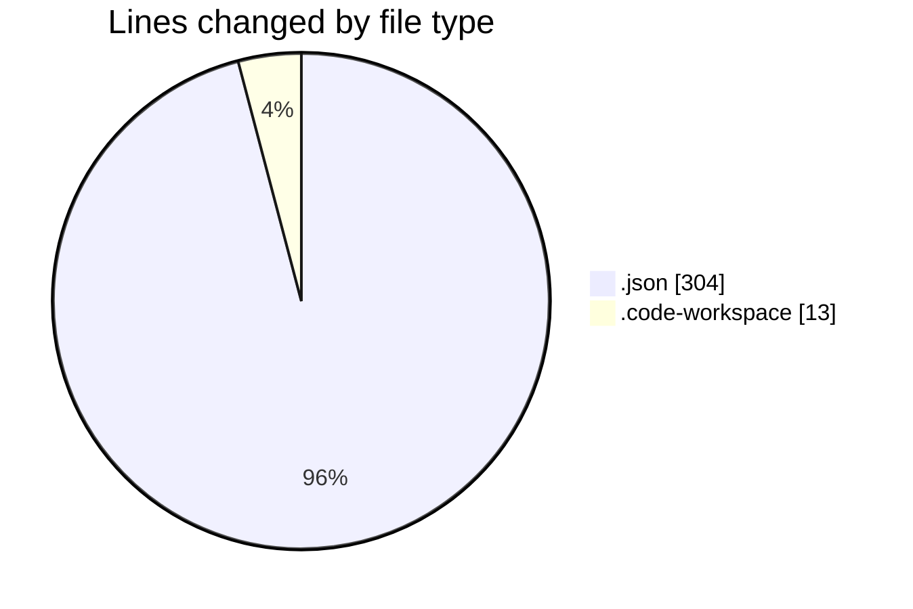
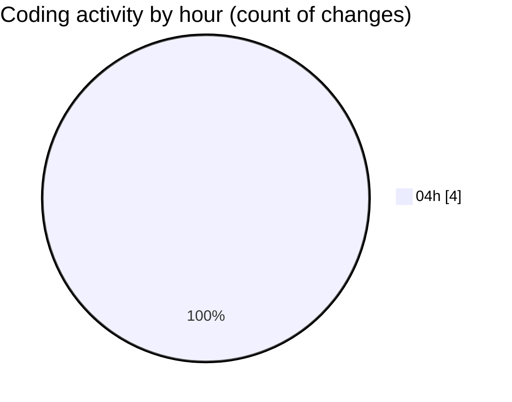

# _monorepo-template (Workspace) - Activity Summary 

## Overall Statistics

| Stat                   | Value                                                             |
| ---------------------- | ----------------------------------------------------------------- |
| **Lines Added** (➕)   | 317                                          |
| **Lines Removed** (➖) | 0                                        |
| **Net Change** (↕)    | 317                |
| **Active Time** (⌚)   | 3 minutes |

## Modified Files
- **mcp_config.json** (+299, -0)
- **extensions.json** (+5, -0)
- **_monorepo-template.code-workspace** (+13, -0)

## Visualizations

### By File Type (Lines Changed)

### By Hour (Estimated Activity Count)

> **Last Updated:** 2/25/2026, 4:52:17 AM