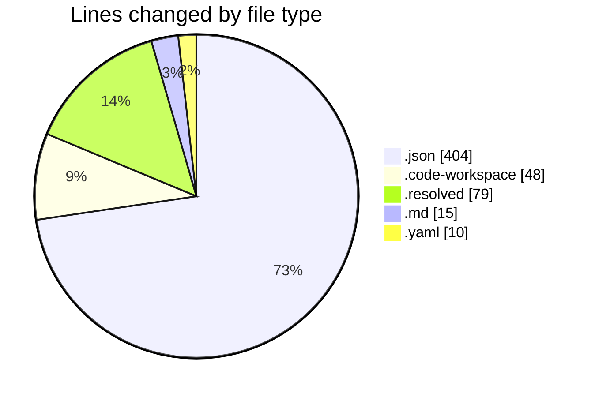
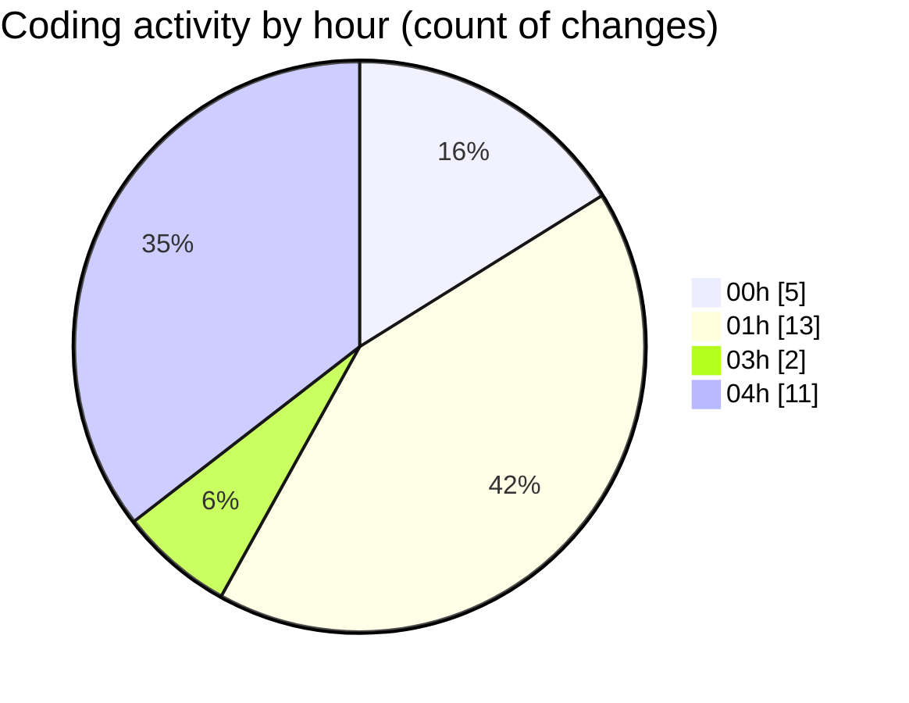

# shadcn-admin-kit-main (Workspace) - Activity Summary 

## Overall Statistics

| Stat                   | Value                                                             |
| ---------------------- | ----------------------------------------------------------------- |
| **Lines Added** (➕)   | 465                                          |
| **Lines Removed** (➖) | 91                                        |
| **Net Change** (↕)    | 374                |
| **Active Time** (⌚)   | 32 minutes |

## Modified Files
- **extensions.json** (+17, -1)
- **shadcn-admin-kit-main.code-workspace** (+47, -1)
- **settings.json** (+76, -3)
- **shadcn-extension.json** (+4, -0)
- **implementation_plan.md.resolved** (+79, -0)
- **task.md** (+15, -0)
- **pnpm-workspace.yaml** (+9, -1)
- **package.json** (+192, -85)
- **turbo.json** (+26, -0)

## Visualizations

### By File Type (Lines Changed)

### By Hour (Estimated Activity Count)

> **Last Updated:** 2/27/2026, 4:38:37 AM