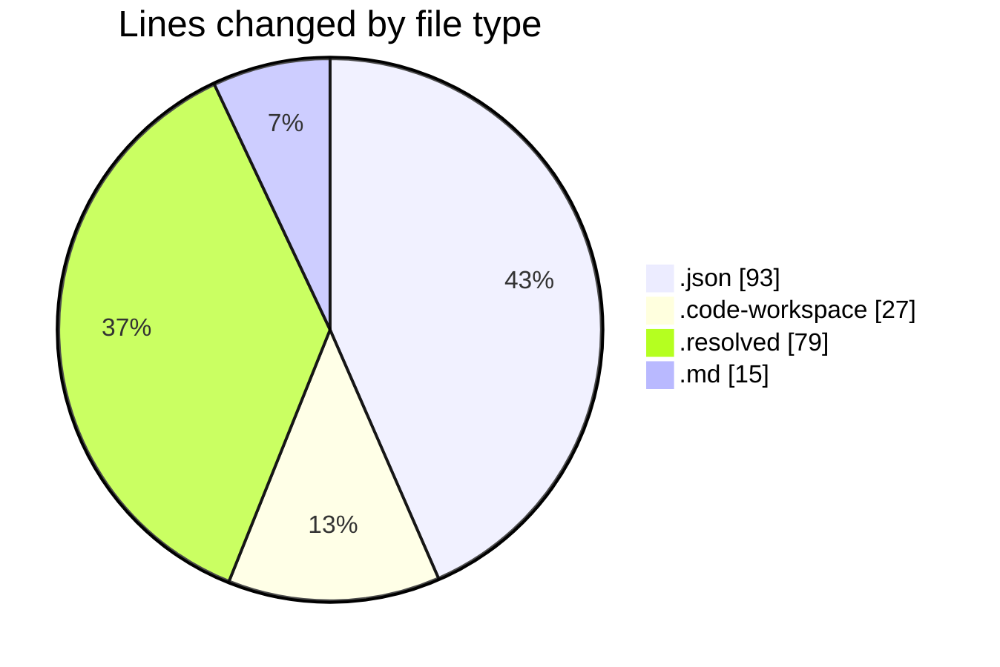
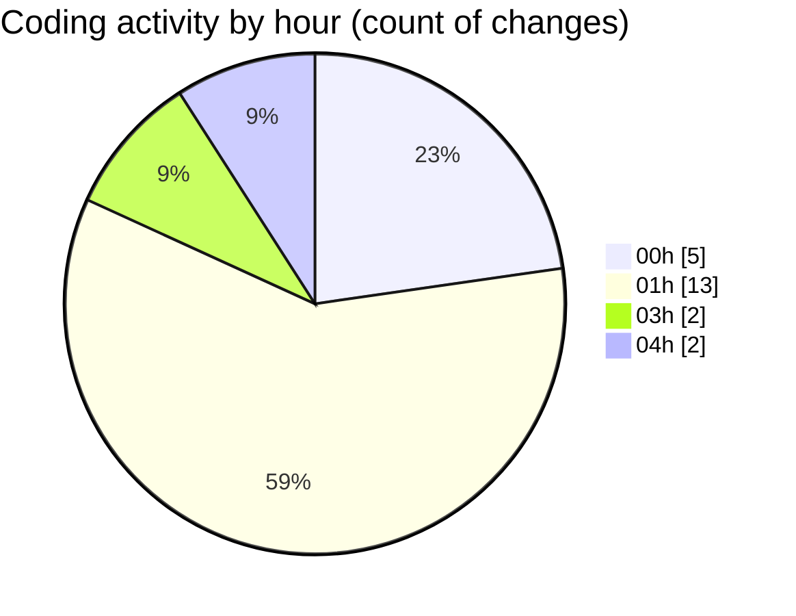

# shadcn-admin-kit-main (Workspace) - Activity Summary 

## Overall Statistics

| Stat                   | Value                                                             |
| ---------------------- | ----------------------------------------------------------------- |
| **Lines Added** (➕)   | 209                                          |
| **Lines Removed** (➖) | 5                                        |
| **Net Change** (↕)    | 204                |
| **Active Time** (⌚)   | 21 minutes |

## Modified Files
- **extensions.json** (+9, -1)
- **shadcn-admin-kit-main.code-workspace** (+26, -1)
- **settings.json** (+76, -3)
- **shadcn-extension.json** (+4, -0)
- **implementation_plan.md.resolved** (+79, -0)
- **task.md** (+15, -0)

## Visualizations

### By File Type (Lines Changed)

### By Hour (Estimated Activity Count)

> **Last Updated:** 2/27/2026, 4:13:37 AM