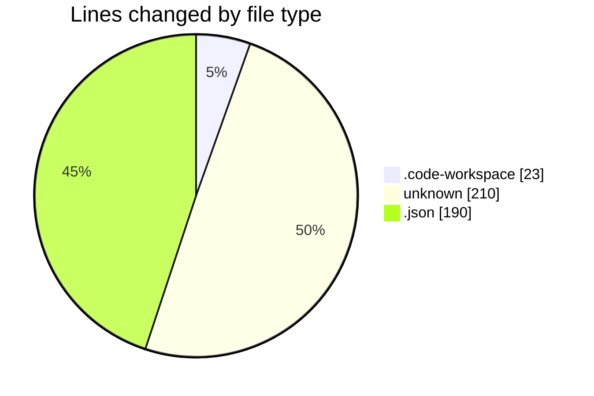
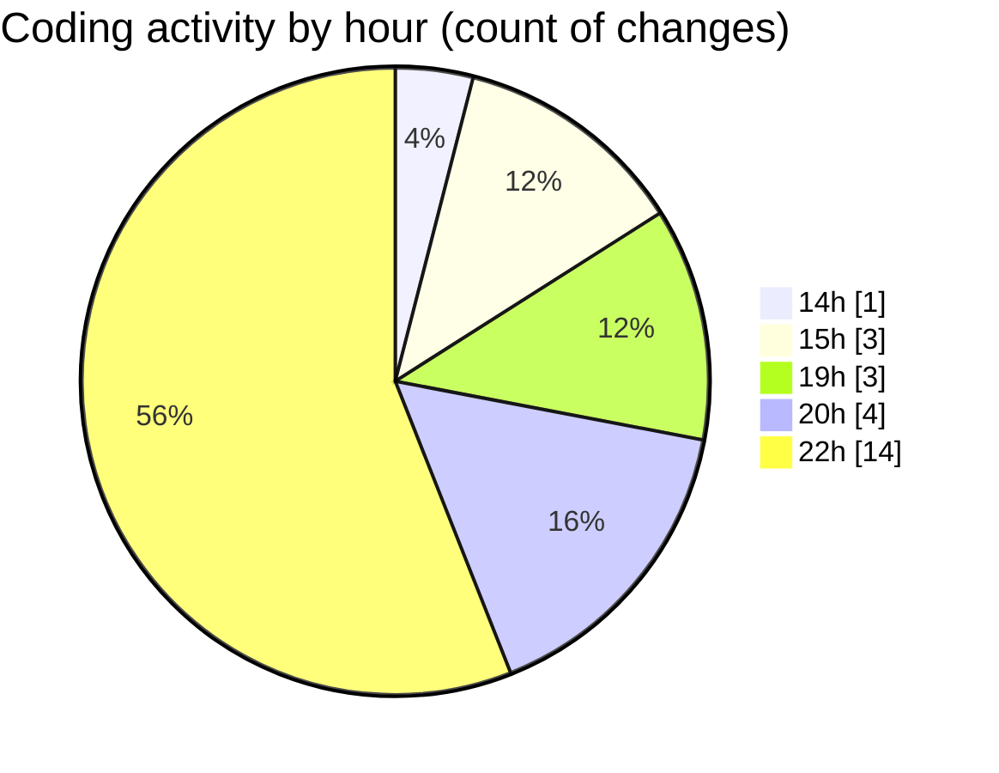

# shadcn-admin-kit-main (Workspace) - Activity Summary 

## Overall Statistics

| Stat                   | Value                                                             |
| ---------------------- | ----------------------------------------------------------------- |
| **Lines Added** (➕)   | 418                                          |
| **Lines Removed** (➖) | 5                                        |
| **Net Change** (↕)    | 413                |
| **Active Time** (⌚)   | 21 minutes |

## Modified Files
- **shadcn-admin-kit-main.code-workspace** (+23, -0)
- **.gitignore** (+44, -0)
- **COMMIT_EDITMSG** (+16, -0)
- **.gitignore** (+150, -0)
- **settings.json** (+171, -5)
- **tasks.json** (+14, -0)

## Visualizations

### By File Type (Lines Changed)

### By Hour (Estimated Activity Count)

> **Last Updated:** 3/2/2026, 10:33:46 PM