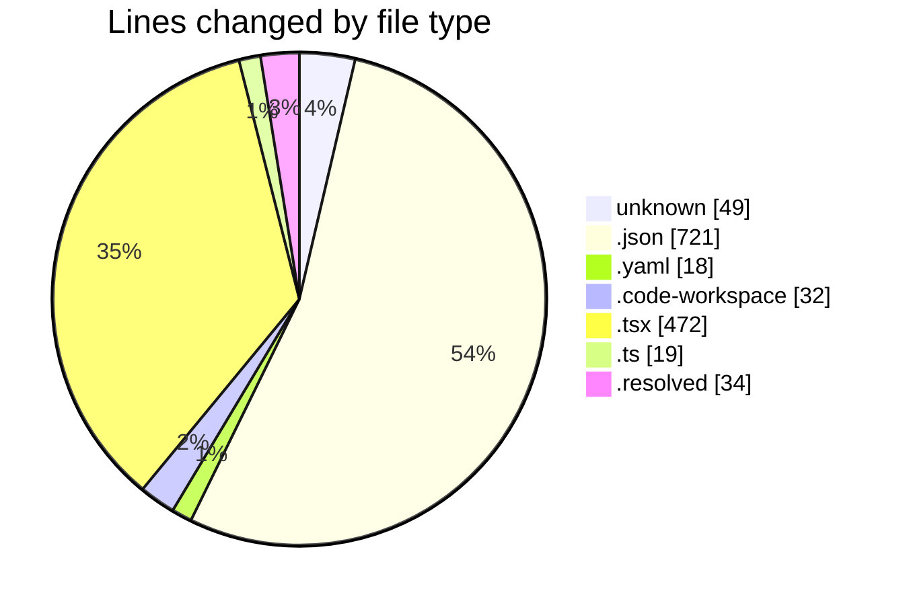
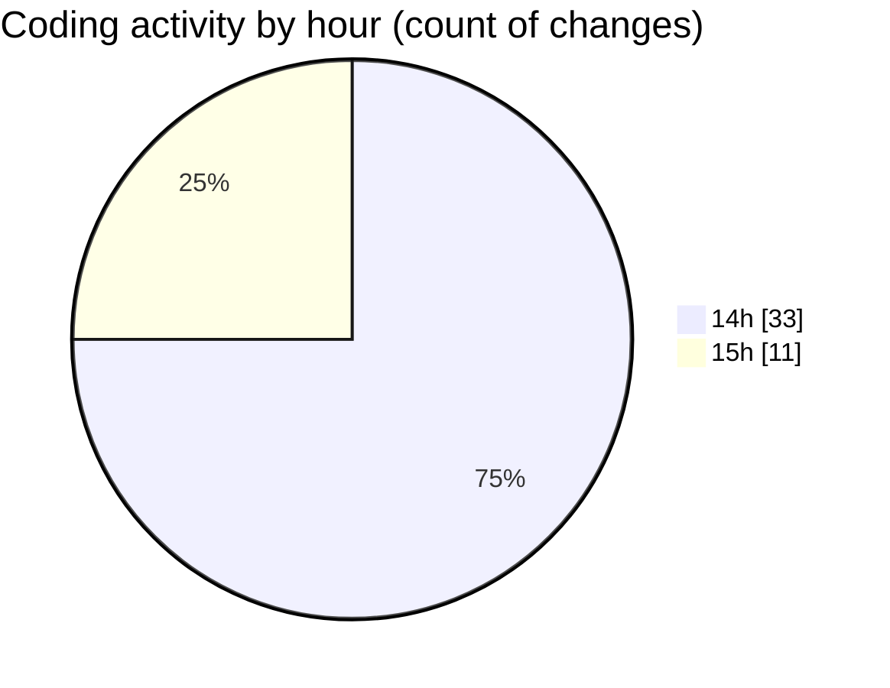

# shadcn-admin-kit-main (Workspace) - Activity Summary 

## Overall Statistics

| Stat                   | Value                                                             |
| ---------------------- | ----------------------------------------------------------------- |
| **Lines Added** (➕)   | 1245                                          |
| **Lines Removed** (➖) | 100                                        |
| **Net Change** (↕)    | 1145                |
| **Active Time** (⌚)   | 52 minutes |

## Modified Files
- **.gitignore** (+47, -0)
- **turbo.json** (+35, -0)
- **package.json** (+105, -81)
- **pnpm-workspace.yaml** (+9, -0)
- **settings.json** (+175, -2)
- **shadcn-admin-kit-main.code-workspace** (+26, -6)
- **package.json** (+100, -0)
- **package.json** (+27, -0)
- **package.json** (+22, -0)
- **FeatureModule.tsx** (+11, -0)
- **index.ts** (+2, -0)
- **theme-provider.tsx** (+55, -0)
- **App.tsx** (+40, -0)
- **.env** (+2, -0)
- **package.json** (+38, -0)
- **file-input.tsx** (+366, -0)
- **vite.config.ts** (+17, -0)
- **scratchpad_kau4wrd7.md.resolved** (+16, -0)
- **turbo.json** (+18, -0)
- **pnpm-workspace.yaml** (+9, -0)
- **package.json** (+107, -11)
- **task.md.resolved** (+18, -0)

## Visualizations

### By File Type (Lines Changed)

### By Hour (Estimated Activity Count)

> **Last Updated:** 3/4/2026, 3:36:24 PM